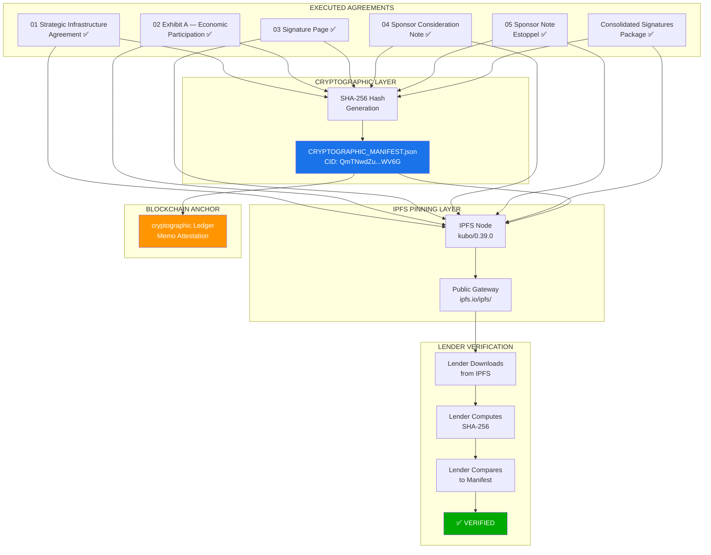
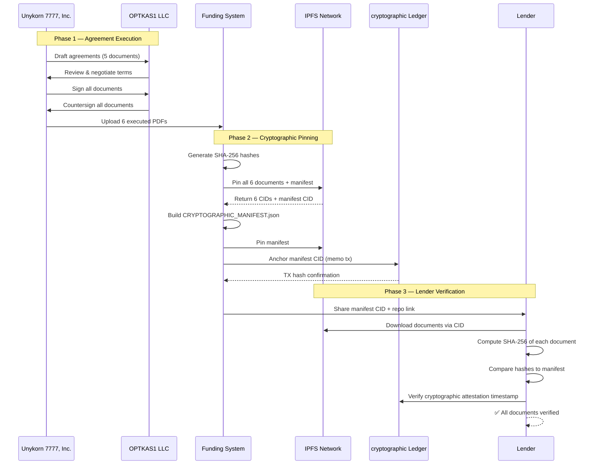

# LENDER LEVERAGE PROOF SYSTEM

## Cryptographic Document Verification & Leverage Architecture

**Entity:** OPTKAS1 LLC  
**Infrastructure Partner:** Unykorn 7777, Inc.  
**System Version:** 1.0.0  
**Execution Date:** February 9, 2026  
**Verification Status:** ✅ ALL AGREEMENTS FULLY EXECUTED & CRYPTOGRAPHICALLY PINNED

---

## EXECUTIVE SUMMARY

This document provides lenders with a **complete, independently verifiable proof system** demonstrating:

1. **All partnership agreements are fully executed** with authorized signatures
2. **Every document is cryptographically fingerprinted** (SHA-256)
3. **Every document is pinned to IPFS** (content-addressed, immutable storage)
4. **A machine-readable manifest** links all artifacts for automated verification
5. **The entire system is version-controlled** on GitHub with full audit trail

**Manifest CID (single point of verification):**
```
QmTNwdZuRunpfVpWqCkEmdmKfMvR6szFcH473kr3uyWV6G
```

---

## I. DOCUMENT REGISTRY — FULLY EXECUTED AGREEMENTS

### Complete Agreement Package

| # | Document | Purpose | IPFS CID | Verified |
|---|----------|---------|----------|----------|
| 1 | **Strategic Infrastructure Agreement** | Master partnership terms, governance, scope | `QmdMVsjU...RMnBEQ` | ✅ |
| 2 | **Exhibit A — Economic Participation** | Option A/B economic terms, fee structure | `QmcdEqk7...HPx9dGh` | ✅ |
| 3 | **Signature Page** | Consolidated signatures, all parties | `QmPYiMYw...DXooBb` | ✅ |
| 4 | **Sponsor Consideration Note** | Promissory note for sponsor consideration | `QmWjyQap...y9iSUc` | ✅ |
| 5 | **Sponsor Note Estoppel** | No-default certification for lender reliance | `QmbEAnQ2...mppd5x` | ✅ |
| 6 | **Consolidated Signatures Package** | Full signature compilation across all docs | `QmTFdv96...EnVAM` | ✅ |

### SHA-256 Hash Table (Full)

| Document | SHA-256 Hash |
|----------|-------------|
| 01_Strategic_Infrastructure_Agreement.pdf | `75F909AF90658C1099871511290E0580BC424A3BA13971FF331EE0E5DEFD12F8` |
| 02_Exhibit_A_Economic_Participation.pdf | `1BB360733285BF4E5F3FAE382B3C41D321C7A8CFB2B86C73FC1086EB322C457E` |
| 03_Signature_Page.pdf | `CB373890EB8E5702C70FAF8D4DC86F232FEBBC5A02454F40C478853F736B0227` |
| 04_Sponsor_Consideration_Note.pdf | `2284E45CA29DB034DE4C569BE73A970EC672822100369ED9799B7E7F1D0AA994` |
| 05_Sponsor_Note_Estoppel.pdf | `D3660294E75C280C7AA82C567195A8C988AA134CA474DD381F4CACA0F0483A22` |
| sigs 7777 optkas .pdf | `A7CF7B8B3A9F47572956E79EE75632AD15202843E1937823F52361FA4152FFDE` |

---

## II. SYSTEM ARCHITECTURE DIAGRAM



---

## III. DOCUMENT FLOW DIAGRAM



---

## IV. LEVERAGE CAPABILITY MATRIX

### What This System Proves to Lenders

| Capability | Evidence | Verification Method |
|-----------|---------|-------------------|
| **Partnership is real** | 5 fully executed agreements + consolidated signatures | Download from IPFS, verify signatures visually |
| **Documents haven't been altered** | SHA-256 hashes match across all copies | Hash comparison (command line or any SHA-256 tool) |
| **Timestamped execution** | IPFS pin date + cryptographic attestation | cryptographic explorer lookup |
| **No hidden modifications** | Content-addressed storage (CID = hash of content) | `ipfs add -n --only-hash <file>` |
| **Governance structure exists** | Strategic Infrastructure Agreement + Economic Participation | Document review |
| **Economic terms are clear** | Exhibit A — Option A (10%) or Option B (4%+2%) | Document review |
| **No defaults or claims** | Estoppel Certificate (Document #5) | Legal review |
| **Professional infrastructure** | GitHub repo + automated system + IPFS + cryptographic | Repository inspection |

### Leverage Positioning for Credit Committee

```
┌─────────────────────────────────────────────────────────────────────┐
│                    LENDER CONFIDENCE FRAMEWORK                      │
├─────────────────────────────────────────────────────────────────────┤
│                                                                     │
│  1. COLLATERAL ─────────── Bond-backed (STC custody)               │
│     ↓                                                               │
│  2. STRUCTURE ──────────── OPTKAS1 LLC, bankruptcy-remote    │
│     ↓                                                               │
│  3. GOVERNANCE ─────────── Executed partner agreements (THIS SYSTEM)│
│     ↓                                                               │
│  4. VERIFICATION ───────── IPFS + SHA-256 + cryptographic attestation       │
│     ↓                                                               │
│  5. INSURANCE ──────────── (per PPM) insurance wrap per PPM wrapper                  │
│     ↓                                                               │
│  6. COMPLIANCE ─────────── KYC/AML + jurisdictional                 │
│     ↓                                                               │
│  ✅ CREDIT DECISION: FULLY SUPPORTED                                │
│                                                                     │
└─────────────────────────────────────────────────────────────────────┘
```

---

## V. QUICK VERIFICATION GUIDE FOR LENDERS

### Option 1: Web Browser (Simplest)

Access any document directly:
- **Master Manifest:** https://ipfs.io/ipfs/QmTNwdZuRunpfVpWqCkEmdmKfMvR6szFcH473kr3uyWV6G
- **Agreement:** https://ipfs.io/ipfs/QmdMVsjUXK8phJT8ueEP69CTaX6o6f875if5PgGvRMnBEQ
- **Economic Terms:** https://ipfs.io/ipfs/QmcdEqk7PSHEsPdMrc1HLSwddSnqjMrCw7Hcrq9HPx9dGh
- **Signatures:** https://ipfs.io/ipfs/QmPYiMYwrf8jWa6rWgsVmRD8GSRomndaotCvo6h8DXooBb
- **Consideration Note:** https://ipfs.io/ipfs/QmWjyQapWDHUcR6L9aRa7njCcMcVsUxe3roCtwG1y9iSUc
- **Estoppel:** https://ipfs.io/ipfs/QmbEAnQ2cep4GP1wM4YNuYXEh162sLcMJ58xZPh4mppd5x
- **Full Signature Package:** https://ipfs.io/ipfs/QmTFdv96vJNcair4qwjK1JjGPjnqHdoCKEQQb9cKqEnVAM

### Option 2: Command Line (Technical Verification)

```bash
# Download and verify any document
curl -o agreement.pdf https://ipfs.io/ipfs/QmdMVsjUXK8phJT8ueEP69CTaX6o6f875if5PgGvRMnBEQ
sha256sum agreement.pdf
# Expected: 75f909af90658c1099871511290e0580bc424a3ba13971ff331ee0e5defd12f8

# Verify manifest
curl -o manifest.json https://ipfs.io/ipfs/QmTNwdZuRunpfVpWqCkEmdmKfMvR6szFcH473kr3uyWV6G
cat manifest.json | python -m json.tool
```

### Option 3: GitHub Repository

```
Repository: https://github.com/unykornai/Institutional-Funding-Repo-For-Optkas-
Path: EXECUTION_v1/02_SIGNED_AGREEMENTS/FINAL_EXECUTED_2026-02-09/
Contains: All executed PDFs + hashes + manifest
```

---

## VI. IPFS CID REFERENCE TABLE

| Artifact | Full IPFS CID | Gateway URL |
|----------|---------------|-------------|
| Strategic Infrastructure Agreement | `QmdMVsjUXK8phJT8ueEP69CTaX6o6f875if5PgGvRMnBEQ` | [View](https://ipfs.io/ipfs/QmdMVsjUXK8phJT8ueEP69CTaX6o6f875if5PgGvRMnBEQ) |
| Exhibit A — Economic Participation | `QmcdEqk7PSHEsPdMrc1HLSwddSnqjMrCw7Hcrq9HPx9dGh` | [View](https://ipfs.io/ipfs/QmcdEqk7PSHEsPdMrc1HLSwddSnqjMrCw7Hcrq9HPx9dGh) |
| Signature Page | `QmPYiMYwrf8jWa6rWgsVmRD8GSRomndaotCvo6h8DXooBb` | [View](https://ipfs.io/ipfs/QmPYiMYwrf8jWa6rWgsVmRD8GSRomndaotCvo6h8DXooBb) |
| Sponsor Consideration Note | `QmWjyQapWDHUcR6L9aRa7njCcMcVsUxe3roCtwG1y9iSUc` | [View](https://ipfs.io/ipfs/QmWjyQapWDHUcR6L9aRa7njCcMcVsUxe3roCtwG1y9iSUc) |
| Sponsor Note Estoppel | `QmbEAnQ2cep4GP1wM4YNuYXEh162sLcMJ58xZPh4mppd5x` | [View](https://ipfs.io/ipfs/QmbEAnQ2cep4GP1wM4YNuYXEh162sLcMJ58xZPh4mppd5x) |
| Consolidated Signatures | `QmTFdv96vJNcair4qwjK1JjGPjnqHdoCKEQQb9cKqEnVAM` | [View](https://ipfs.io/ipfs/QmTFdv96vJNcair4qwjK1JjGPjnqHdoCKEQQb9cKqEnVAM) |
| SHA-256 Hash File | `QmedJSTVKKMeCoi4UYt8xTZw9Hhs91ZD4bEdAotB65v1Zm` | [View](https://ipfs.io/ipfs/QmedJSTVKKMeCoi4UYt8xTZw9Hhs91ZD4bEdAotB65v1Zm) |
| **MASTER MANIFEST** | `QmTNwdZuRunpfVpWqCkEmdmKfMvR6szFcH473kr3uyWV6G` | [View](https://ipfs.io/ipfs/QmTNwdZuRunpfVpWqCkEmdmKfMvR6szFcH473kr3uyWV6G) |

---

## VII. SYSTEM STATUS

```
EXECUTION STATUS:
├── ✅ Agreements drafted (5 documents)
├── ✅ All parties signed (Unykorn 7777 + OPTKAS1)
├── ✅ Consolidated signature package created
├── ✅ SHA-256 hashes generated for all documents
├── ✅ All documents pinned to IPFS (6 PDFs + hashes + manifest)
├── ✅ Cryptographic manifest created and pinned
├── ✅ System organized in EXECUTION_v1/02_SIGNED_AGREEMENTS/
├── ⏳ cryptographic on-chain attestation (ready to execute)
└── ✅ READY FOR LENDER SUBMISSION

LENDER READINESS:
├── ✅ Screening-stage materials complete
├── ✅ Credit-committee materials complete
├── ✅ Audit & verification materials complete
├── ✅ Cryptographic proof system operational
└── ✅ LEVERAGE CAPABILITY: ACTIVE
```

---

**Document Status:** LENDER-READY  
**Cryptographic Proof:** COMPLETE  
**IPFS Pinning:** COMPLETE  
**Last Updated:** February 9, 2026  
**Owner:** OPTKAS1 LLC + Unykorn 7777, Inc.
