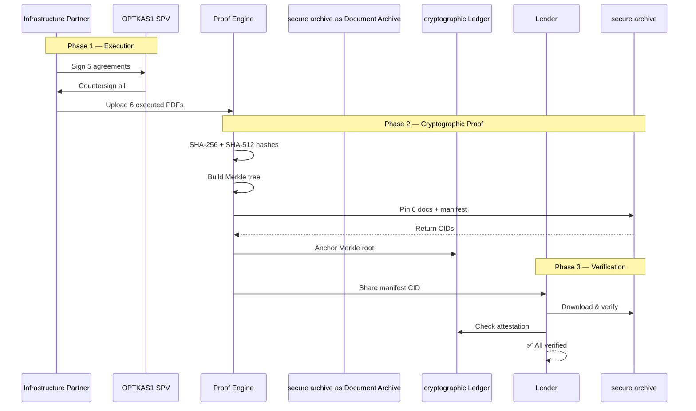

# LENDER PROOF PACKAGE

## OPTKAS1 LLC — Cryptographic Document Verification

**Generated:** 2026-02-09T17:07:24.139941+00:00
**Merkle Root:** `5A859413146252D45254FA1BA0B391B23E10F5C880FB5143DE5888EFD36749A8`
**secure archive Manifest:** `[Manifest Reference]`
**Repository:** https://github.com/unykornai/Institutional-Funding-Repo-For-Optkas-

---

## EXECUTED DOCUMENTS

| # | Document | SHA-256 | Document Reference | Status |
|---|----------|---------|----------|--------|
| 1 | Strategic Infrastructure & Execution Agreement | `75F909AF90658C10...` | `QmdMVsjUXK8phJT8ueEP...` | ✅ |
| 2 | Exhibit A - Economic Participation Schedule | `1BB360733285BF4E...` | `QmcdEqk7PSHEsPdMrc1H...` | ✅ |
| 3 | Signature Page - All Parties | `CB373890EB8E5702...` | `QmPYiMYwrf8jWa6rWgsV...` | ✅ |
| 4 | Sponsor Consideration & Promissory Note | `2284E45CA29DB034...` | `QmWjyQapWDHUcR6L9aRa...` | ✅ |
| 5 | Sponsor Note Estoppel Certificate | `D3660294E75C280C...` | `QmbEAnQ2cep4GP1wM4YN...` | ✅ |
| 6 | Combined Signature Attestation - 7777 x OPTKAS | `A7CF7B8B3A9F4757...` | `QmTFdv96vJNcair4qwjK...` | ✅ |

---

## VERIFICATION ARCHITECTURE

```mermaid
graph TB
    subgraph EXECUTED["FULLY EXECUTED AGREEMENTS"]
        D1["01 Strategic Infrastructure Agreement"]
        D2["02 Exhibit A — Economic Participation"]
        D3["03 Signature Page — All Parties"]
        D4["04 Sponsor Consideration Note"]
        D5["05 Sponsor Note Estoppel"]
        D6["06 Consolidated Signatures"]
    end

    subgraph CRYPTO["CRYPTOGRAPHIC LAYER"]
        HASH["SHA-256 + SHA-512\nDual Hash"]
        MERKLE["Merkle Tree\nRoot: 5A859413146252D4..."]
        MANIFEST["Proof Manifest\nCID: QmTNwdZuRunpfVpW..."]
    end

    subgraph IMMUTABLE["IMMUTABLE STORAGE"]
        secure archive["Document Archive\nkubo/0.39.0"]
        cryptographic["cryptographic Ledger\nMemo Attestation"]
        GIT["GitHub\nunykornai/Institutional-Funding-Repo-For-Optkas-"]
    end

    subgraph VERIFY["LENDER VERIFICATION"]
        DL["Download from secure archive"]
        CHECK["Compute SHA-256"]
        COMPARE["Compare to Manifest"]
        RESULT["✅ VERIFIED"]
    end

    D1 & D2 & D3 & D4 & D5 & D6 --> HASH
    HASH --> MERKLE --> MANIFEST
    D1 & D2 & D3 & D4 & D5 & D6 --> secure archive
    MANIFEST --> secure archive & cryptographic & GIT
    secure archive --> DL --> CHECK --> COMPARE --> RESULT

    style RESULT fill:#00aa00,color:#fff
    style MANIFEST fill:#1a73e8,color:#fff
    style cryptographic fill:#ff9500,color:#fff
    style MERKLE fill:#7c4dff,color:#fff
```

---

## DOCUMENT FLOW



---

## LEVERAGE MATRIX

| What This Proves | Evidence | How to Verify |
|-----------------|----------|---------------|
| Partnership is executed | 5 signed agreements + consolidated sigs | Download from secure archive, inspect signatures |
| Documents are unaltered | SHA-256 hashes match | Recompute hash, compare to manifest |
| Execution is timestamped | archive date + cryptographic memo | cryptographic explorer lookup |
| No hidden modifications | Content-addressed CIDs | `# archive -n --only-hash <file>` |
| Governance structure exists | Strategic Agreement + Exhibit A | Document review |
| No defaults or claims | Estoppel Certificate (DOC-005) | Legal review |
| Professional infrastructure | GitHub + secure archive + cryptographic + Merkle tree | Repository inspection |

---

## secure archive ACCESS LINKS

- **Strategic Infrastructure & Execution Agreement**: https://[Agreement Reference]
- **Exhibit A - Economic Participation Schedule**: https://[Terms Reference]
- **Signature Page - All Parties**: https://[Signature Reference]
- **Sponsor Consideration & Promissory Note**: https://[Note Reference]
- **Sponsor Note Estoppel Certificate**: https://[Estoppel Reference]
- **Combined Signature Attestation - 7777 x OPTKAS**: https://[Package Reference]
- **Master Manifest**: https://[Manifest Reference]

---

**Merkle Root:** `5A859413146252D45254FA1BA0B391B23E10F5C880FB5143DE5888EFD36749A8`
**Manifest CID:** `[Manifest Reference]`
**Verify:** `python # Standard document verification`
